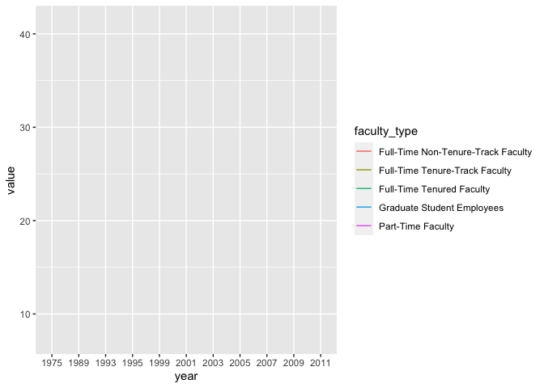

Lab 06 - Ugly charts and Simpson’s paradox
================
Heather Hawkins
02-14-23

### Load packages and data

``` r
library(tidyverse) 
library(dsbox)
library(mosaicData) 
```

### Exercise 1

``` r
staff <- read_csv("data/instructional-staff.csv")
```

    ## Rows: 5 Columns: 12
    ## ── Column specification ────────────────────────────────────────────────────────
    ## Delimiter: ","
    ## chr  (1): faculty_type
    ## dbl (11): 1975, 1989, 1993, 1995, 1999, 2001, 2003, 2005, 2007, 2009, 2011
    ## 
    ## ℹ Use `spec()` to retrieve the full column specification for this data.
    ## ℹ Specify the column types or set `show_col_types = FALSE` to quiet this message.

``` r
#Turning into a longer data frame
staff_long <- staff %>%
  pivot_longer(cols = -faculty_type, names_to = "year") %>%
  mutate(value = as.numeric(value))

#Plotting long data
staff_long %>%
  ggplot(aes(x = year, y = value, color = faculty_type)) +
  geom_line()
```

    ## `geom_line()`: Each group consists of only one observation.
    ## ℹ Do you need to adjust the group aesthetic?

<!-- -->

``` r
#Fixing data points
staff_long %>%
  ggplot(aes(x = year,
             y = value,
             group = faculty_type,
             color = faculty_type)) +
  geom_line()+ labs(title="Instructional Staff Employment Trends ", subtitle="American Association of University Professors (AAUP)",
   x="Year", y="Number of Hires", color="Faculty Type")
```

<!-- -->

### Exercise 2

Suppose the objective of this plot was to show that the proportion of
part-time faculty have gone up over time compared to other instructional
staff types. \> What changes would you propose making to this plot to
tell this story?

I would group all of the other groups (Full-Time Non Tenure, Full-Time
Tenure-Track, Full-Time Tenured, and Grad Student Employees) data
together, and compare that data to the Part-Time data within the graph.

``` r
staff_compare <- staff_long %>%
  subset(faculty_type!="Part-Time Faculty")

staff_compare<- staff_compare %>%
  group_by(year)%>%
  summarise(mean_pct=mean(value),
            faculty_type="other_types")

pt_faculty <- staff_long %>%
  subset(faculty_type=="Part-Time Faculty")

#Plotting
staff_compare %>%
  ggplot()+ geom_line(data=pt_faculty,aes(x = year,
           y = value,
           group = faculty_type,
           color = faculty_type))+
geom_line(data=staff_compare,aes(x = year,
           y = mean_pct,
           group = faculty_type,
           color = faculty_type))+ labs(title="Instructional Staff Employment Trends ", subtitle="American Association of University Professors (AAUP)",
   x="Year", y="Number of Hires", color="Faculty Type")
```

<!-- -->

### Exercise 3

Can you help them make improve it? First, brainstorm how you would
improve it. Then create the improved visualization and document your
changes/decisions with bullet points. It’s ok if some of your
improvements are aspirational, i.e. you don’t know how to implement it,
but you think it’s a good idea. Implement what you can and leave notes
identifying the aspirational improvements that could not be made.

To improve the fisheries graph, we could plot the data with a cap scale-
since there are only a few countries that farm and capture an enormous
amount of fish.

Or maybe even focus on the TOP countries that farm and capture fish.
Since this Lab is about converting data and comparing, Ill focus on the
second method

``` r
fisheries <- read_csv("data/fisheries.csv")
```

    ## Rows: 216 Columns: 4
    ## ── Column specification ────────────────────────────────────────────────────────
    ## Delimiter: ","
    ## chr (1): country
    ## dbl (3): capture, aquaculture, total
    ## 
    ## ℹ Use `spec()` to retrieve the full column specification for this data.
    ## ℹ Specify the column types or set `show_col_types = FALSE` to quiet this message.

``` r
fisheries_long <- fisheries %>%
  pivot_longer(cols = -country, names_to = "Fishing_Type") %>%
  filter(Fishing_Type %in% c("capture", "aquaculture")) %>%
  mutate(value = as.numeric(value))

#Plotting

fisheries_long %>%
  filter(country %in% c("China", "Indonesia", "India", "Vietnam", "United States")) %>%
  ggplot(aes(group = Fishing_Type, color= Fishing_Type, y=value, x=country)) + labs(title="Tons of Fish Produced by Top Fishing Countries ",
   x="Countries", y="Number of Fish by Tons", color="Fishing Types")+   geom_line()
```

<!-- --> \### Exercise 4

## Part 1

## Part 2

## Part 3

## Part 4

## Part 5

## Part 6

## Part 7
