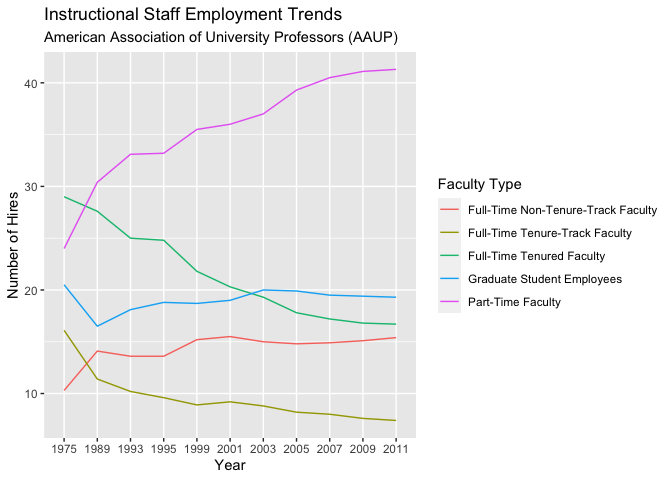
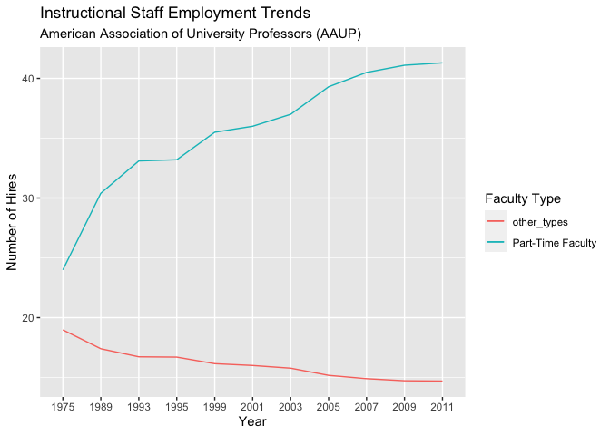
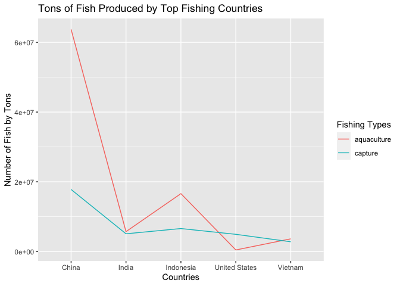
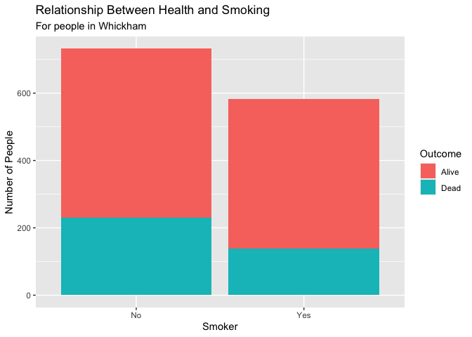
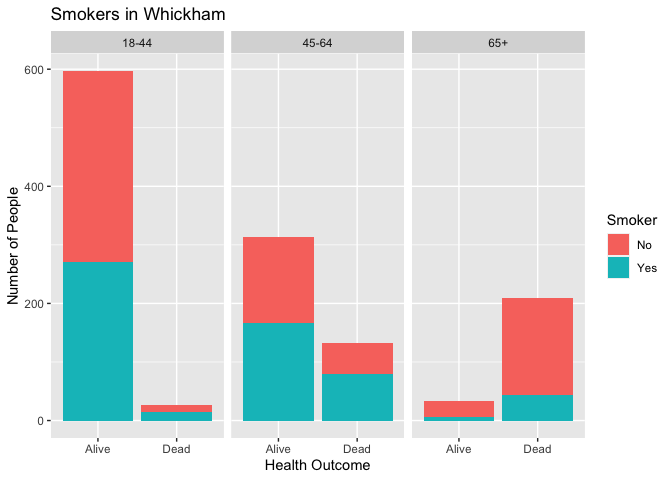

Lab 06 - Ugly charts and Simpson’s paradox
================
Heather Hawkins
02-14-23

### Load packages and data

``` r
library(tidyverse) 
library(dsbox)
library(mosaicData) 
```

### Exercise 1

``` r
staff <- read_csv("data/instructional-staff.csv")
```

    ## Rows: 5 Columns: 12
    ## ── Column specification ────────────────────────────────────────────────────────
    ## Delimiter: ","
    ## chr  (1): faculty_type
    ## dbl (11): 1975, 1989, 1993, 1995, 1999, 2001, 2003, 2005, 2007, 2009, 2011
    ## 
    ## ℹ Use `spec()` to retrieve the full column specification for this data.
    ## ℹ Specify the column types or set `show_col_types = FALSE` to quiet this message.

``` r
view(staff)

#Turning into a longer data frame
staff_long <- staff %>%
  pivot_longer(cols = -faculty_type, names_to = "year") %>%
  mutate(value = as.numeric(value))

#Plotting long data
staff_long %>%
  ggplot(aes(x = year, y = value, color = faculty_type)) +
  geom_line()
```

    ## `geom_line()`: Each group consists of only one observation.
    ## ℹ Do you need to adjust the group aesthetic?

<!-- -->

``` r
#Fixing data points
staff_long %>%
  ggplot(aes(x = year,
             y = value,
             group = faculty_type,
             color = faculty_type)) +
  geom_line()+ labs(title="Instructional Staff Employment Trends ", subtitle="American Association of University Professors (AAUP)",
   x="Year", y="Number of Hires", color="Faculty Type")
```

<!-- -->

### Exercise 2

Suppose the objective of this plot was to show that the proportion of
part-time faculty have gone up over time compared to other instructional
staff types. \> What changes would you propose making to this plot to
tell this story?

I would group all of the other groups (Full-Time Non Tenure, Full-Time
Tenure-Track, Full-Time Tenured, and Grad Student Employees) data
together, and compare that data to the Part-Time data within the graph.

``` r
staff_compare <- staff_long %>%
  subset(faculty_type!="Part-Time Faculty")

staff_compare<- staff_compare %>%
  group_by(year)%>%
  summarise(mean_pct=mean(value),
            faculty_type="other_types")

pt_faculty <- staff_long %>%
  subset(faculty_type=="Part-Time Faculty")

#Plotting
staff_compare %>%
  ggplot()+ geom_line(data=pt_faculty,aes(x = year,
           y = value,
           group = faculty_type,
           color = faculty_type))+
geom_line(data=staff_compare,aes(x = year,
           y = mean_pct,
           group = faculty_type,
           color = faculty_type))+ labs(title="Instructional Staff Employment Trends ", subtitle="American Association of University Professors (AAUP)",
   x="Year", y="Number of Hires", color="Faculty Type")
```

<!-- -->

### Exercise 3

Can you help them make improve it? First, brainstorm how you would
improve it. Then create the improved visualization and document your
changes/decisions with bullet points. It’s ok if some of your
improvements are aspirational, i.e. you don’t know how to implement it,
but you think it’s a good idea. Implement what you can and leave notes
identifying the aspirational improvements that could not be made.

To improve the fisheries graph, we could plot the data with a cap scale-
since there are only a few countries that farm and capture an enormous
amount of fish.

Or maybe even focus on the TOP countries that farm and capture fish.
Since this Lab is about converting data and comparing, Ill focus on the
second method

``` r
fisheries <- read_csv("data/fisheries.csv")
```

    ## Rows: 216 Columns: 4
    ## ── Column specification ────────────────────────────────────────────────────────
    ## Delimiter: ","
    ## chr (1): country
    ## dbl (3): capture, aquaculture, total
    ## 
    ## ℹ Use `spec()` to retrieve the full column specification for this data.
    ## ℹ Specify the column types or set `show_col_types = FALSE` to quiet this message.

``` r
fisheries_long <- fisheries %>%
  pivot_longer(cols = -country, names_to = "Fishing_Type") %>%
  filter(Fishing_Type %in% c("capture", "aquaculture")) %>%
  mutate(value = as.numeric(value))

#Plotting

fisheries_long %>%
  filter(country %in% c("China", "Indonesia", "India", "Vietnam", "United States")) %>%
  ggplot(aes(group = Fishing_Type, color= Fishing_Type, y=value, x=country)) + labs(title="Tons of Fish Produced by Top Fishing Countries ",
   x="Countries", y="Number of Fish by Tons", color="Fishing Types")+   geom_line()
```

<!-- --> \### Exercise 4

``` r
library(tidyverse) 
library(mosaicData) 

data(Whickham)

view(Whickham)
```

## Part 1

What type of study do you think these data come from: observational or
experiment? Why?

Observational, since this is quasi-experimental data (i.e., we are not
making people smokers or non smokers, not making them dead or alive)
there are no manipulations used, therefore we can just collect and
observe the data.

## Part 2

How many observations are in this dataset? What does each observation
represent?

There are 1314 observations, Each observation is a person in Whickham.

``` r
summary(Whickham)
```

    ##   outcome    smoker         age       
    ##  Alive:945   No :732   Min.   :18.00  
    ##  Dead :369   Yes:582   1st Qu.:32.00  
    ##                        Median :46.00  
    ##                        Mean   :46.92  
    ##                        3rd Qu.:61.00  
    ##                        Max.   :84.00

## Part 3

How many variables are in this dataset? What type of variable is each?
Display each variable using an appropriate visualization.

There are only 3 variables: Outcome (Dead or Alive), Smoker(non and
smoker), and Age. Outcome and Smoker are categorical data, while age is
numeric.

``` r
Whickham %>%
ggplot(aes(x=age, fill=smoker)) +geom_bar()+ facet_wrap(~outcome)+ labs (title= "Smokers in Whickham", x= "Age", y= "Number of People" ) + labs(fill="Smoker") 
```

<!-- --> \## Part 4
What would you expect the relationship between smoking status and health
outcome to be?

I expect a negative correlation

## Part 5

Create a visualization depicting the relationship between smoking status
and health outcome. Briefly describe the relationship, and evaluate
whether this meets your expectations. Additionally, calculate the
relevant conditional probabilities to help your narrative. Here is some
code to get you started:

``` r
Whickham %>%
ggplot(aes(fill = smoker, x = outcome))+
geom_bar()+ labs (title= "Relationship Between Health and Smoking", x= "Health Outcome", subtitle= "For people in Whickham", y= "Number of People" ) + labs(fill="Smoker") 
```

<!-- --> \## Part 6 Create a
new variable called age_cat using the following scheme: age \<= 44 \~
“18-44” age \> 44 & age \<= 64 \~ “45-64” age \> 64 \~ “65+”

``` r
Whickham_Age <- Whickham %>% 
  mutate(age_cat = case_when(
    age <= 44 ~ "18-44",
    age > 44 & age <= 64 ~ "45-64",
    age > 64 ~ "65+"))
```

## Part 7

Re-create the visualization depicting the relationship between smoking
status and health outcome, faceted by age_cat. What changed? What might
explain this change? Extend the contingency table from earlier by
breaking it down by age category and use it to help your narrative. We
can use the contingency table to examine how the relationship between
smoking status and health outcome differs between different age groups.
This extension will help us better understand the patterns we see in the
visualization, and explain any changes we observe.

``` r
Whickham_Age %>%
  count(smoker, age, outcome)
```

    ##     smoker age outcome  n
    ## 1       No  18   Alive 10
    ## 2       No  18    Dead  1
    ## 3       No  19   Alive  8
    ## 4       No  20   Alive 11
    ## 5       No  21   Alive  8
    ## 6       No  22   Alive  8
    ## 7       No  23   Alive 12
    ## 8       No  24   Alive 14
    ## 9       No  25   Alive 14
    ## 10      No  26   Alive 13
    ## 11      No  27   Alive 19
    ## 12      No  27    Dead  1
    ## 13      No  28   Alive 21
    ## 14      No  29   Alive  8
    ## 15      No  29    Dead  1
    ## 16      No  30   Alive 16
    ## 17      No  31   Alive 15
    ## 18      No  32   Alive 15
    ## 19      No  32    Dead  1
    ## 20      No  33   Alive 15
    ## 21      No  33    Dead  1
    ## 22      No  34   Alive 16
    ## 23      No  35   Alive 13
    ## 24      No  35    Dead  2
    ## 25      No  36   Alive  6
    ## 26      No  36    Dead  1
    ## 27      No  37   Alive 14
    ## 28      No  38   Alive 12
    ## 29      No  38    Dead  1
    ## 30      No  39   Alive 12
    ## 31      No  40   Alive 10
    ## 32      No  41   Alive  9
    ## 33      No  42   Alive  7
    ## 34      No  42    Dead  1
    ## 35      No  43   Alive  8
    ## 36      No  43    Dead  2
    ## 37      No  44   Alive 13
    ## 38      No  45   Alive  8
    ## 39      No  45    Dead  2
    ## 40      No  46   Alive  4
    ## 41      No  46    Dead  2
    ## 42      No  47   Alive  6
    ## 43      No  47    Dead  1
    ## 44      No  48   Alive 10
    ## 45      No  49   Alive  3
    ## 46      No  49    Dead  2
    ## 47      No  50   Alive  4
    ## 48      No  50    Dead  1
    ## 49      No  51   Alive 11
    ## 50      No  51    Dead  2
    ## 51      No  52   Alive  8
    ## 52      No  52    Dead  1
    ## 53      No  53   Alive  8
    ## 54      No  54   Alive  4
    ## 55      No  54    Dead  1
    ## 56      No  55   Alive 12
    ## 57      No  55    Dead  5
    ## 58      No  56   Alive  9
    ## 59      No  56    Dead  7
    ## 60      No  57   Alive  5
    ## 61      No  57    Dead  2
    ## 62      No  58   Alive 10
    ## 63      No  58    Dead  2
    ## 64      No  59   Alive  5
    ## 65      No  59    Dead  4
    ## 66      No  60   Alive  6
    ## 67      No  60    Dead  6
    ## 68      No  61   Alive  9
    ## 69      No  61    Dead  4
    ## 70      No  62   Alive  6
    ## 71      No  62    Dead  4
    ## 72      No  63   Alive  7
    ## 73      No  63    Dead  2
    ## 74      No  64   Alive 12
    ## 75      No  64    Dead  5
    ## 76      No  65   Alive  3
    ## 77      No  65    Dead 10
    ## 78      No  66   Alive  6
    ## 79      No  66    Dead  7
    ## 80      No  67   Alive  6
    ## 81      No  67    Dead  9
    ## 82      No  68   Alive  2
    ## 83      No  68    Dead 16
    ## 84      No  69    Dead  9
    ## 85      No  70   Alive  1
    ## 86      No  70    Dead  6
    ## 87      No  71   Alive  2
    ## 88      No  71    Dead 13
    ## 89      No  72   Alive  2
    ## 90      No  72    Dead 14
    ## 91      No  73   Alive  1
    ## 92      No  73    Dead 10
    ## 93      No  74   Alive  5
    ## 94      No  74    Dead  7
    ## 95      No  75    Dead  2
    ## 96      No  76    Dead  6
    ## 97      No  77    Dead  9
    ## 98      No  78    Dead  9
    ## 99      No  79    Dead  6
    ## 100     No  80    Dead  8
    ## 101     No  81    Dead  3
    ## 102     No  82    Dead  9
    ## 103     No  83    Dead  3
    ## 104     No  84    Dead  9
    ## 105    Yes  18   Alive 10
    ## 106    Yes  19   Alive  6
    ## 107    Yes  20   Alive  7
    ## 108    Yes  20    Dead  1
    ## 109    Yes  21   Alive  7
    ## 110    Yes  21    Dead  1
    ## 111    Yes  22   Alive  4
    ## 112    Yes  23   Alive 13
    ## 113    Yes  24   Alive  6
    ## 114    Yes  25   Alive 14
    ## 115    Yes  26   Alive 14
    ## 116    Yes  27   Alive  7
    ## 117    Yes  27    Dead  1
    ## 118    Yes  28   Alive 11
    ## 119    Yes  29   Alive 10
    ## 120    Yes  30   Alive 11
    ## 121    Yes  31   Alive 14
    ## 122    Yes  31    Dead  1
    ## 123    Yes  32   Alive 14
    ## 124    Yes  33   Alive 15
    ## 125    Yes  33    Dead  1
    ## 126    Yes  34   Alive 12
    ## 127    Yes  35   Alive  7
    ## 128    Yes  36   Alive 17
    ## 129    Yes  36    Dead  1
    ## 130    Yes  37   Alive 11
    ## 131    Yes  38   Alive  9
    ## 132    Yes  38    Dead  1
    ## 133    Yes  39   Alive  9
    ## 134    Yes  39    Dead  1
    ## 135    Yes  40   Alive  3
    ## 136    Yes  40    Dead  2
    ## 137    Yes  41   Alive 11
    ## 138    Yes  42   Alive  9
    ## 139    Yes  42    Dead  2
    ## 140    Yes  43   Alive  9
    ## 141    Yes  43    Dead  2
    ## 142    Yes  44   Alive 10
    ## 143    Yes  44    Dead  1
    ## 144    Yes  45   Alive  9
    ## 145    Yes  45    Dead  5
    ## 146    Yes  46   Alive 16
    ## 147    Yes  46    Dead  4
    ## 148    Yes  47   Alive 12
    ## 149    Yes  47    Dead  2
    ## 150    Yes  48   Alive  9
    ## 151    Yes  48    Dead  2
    ## 152    Yes  49   Alive  8
    ## 153    Yes  49    Dead  2
    ## 154    Yes  50   Alive 13
    ## 155    Yes  50    Dead  2
    ## 156    Yes  51   Alive  8
    ## 157    Yes  51    Dead  3
    ## 158    Yes  52   Alive 10
    ## 159    Yes  52    Dead  3
    ## 160    Yes  53   Alive 10
    ## 161    Yes  53    Dead  5
    ## 162    Yes  54   Alive  8
    ## 163    Yes  55   Alive  4
    ## 164    Yes  55    Dead  2
    ## 165    Yes  56   Alive  6
    ## 166    Yes  56    Dead  6
    ## 167    Yes  57   Alive  7
    ## 168    Yes  57    Dead  5
    ## 169    Yes  58   Alive  8
    ## 170    Yes  58    Dead  3
    ## 171    Yes  59   Alive  4
    ## 172    Yes  59    Dead  5
    ## 173    Yes  60   Alive  4
    ## 174    Yes  60    Dead 11
    ## 175    Yes  61   Alive  6
    ## 176    Yes  61    Dead  7
    ## 177    Yes  62   Alive  9
    ## 178    Yes  62    Dead  3
    ## 179    Yes  63   Alive  9
    ## 180    Yes  63    Dead  7
    ## 181    Yes  64   Alive  7
    ## 182    Yes  64    Dead  3
    ## 183    Yes  65    Dead  1
    ## 184    Yes  66   Alive  1
    ## 185    Yes  66    Dead  5
    ## 186    Yes  67   Alive  2
    ## 187    Yes  67    Dead  1
    ## 188    Yes  68    Dead  4
    ## 189    Yes  69    Dead  2
    ## 190    Yes  70    Dead  1
    ## 191    Yes  71   Alive  1
    ## 192    Yes  71    Dead  7
    ## 193    Yes  72    Dead  6
    ## 194    Yes  73    Dead  3
    ## 195    Yes  74   Alive  2
    ## 196    Yes  74    Dead  1
    ## 197    Yes  75    Dead  1
    ## 198    Yes  76    Dead  1
    ## 199    Yes  77    Dead  1
    ## 200    Yes  78    Dead  1
    ## 201    Yes  80    Dead  1
    ## 202    Yes  81    Dead  3
    ## 203    Yes  82    Dead  3
    ## 204    Yes  83    Dead  1
    ## 205    Yes  84    Dead  1

``` r
Whickham_Age %>%
ggplot(aes(fill = smoker, x = outcome))+
facet_wrap(~age_cat)+geom_bar()+ labs (title= "Smokers in Whickham", x= "Health Outcome", y= "Number of People" ) + labs(fill="Smoker") 
```

<!-- --> \`\`\`
